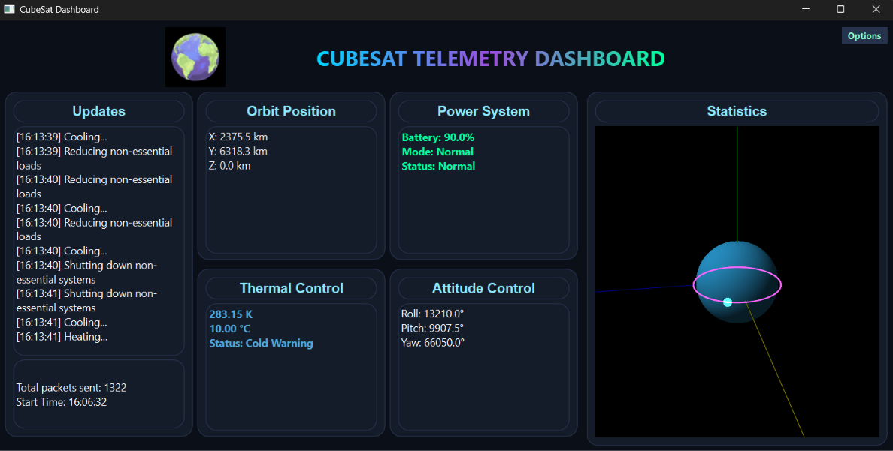

# Integrated Cubesat Operations Platform

A software platform designed to simulate CubeSat operations through a closed-loop communication system between a MATLAB-based space environment simulator and a Python-based satellite controller. The system uses MQTT communication to transmit telemetry data and send corrective commands, allowing the CubeSat to respond to changes in orbital position, power, temperature, and attitude.

The project demonstrates spacecraft simulation, real-time data communication, control systems, telemetry visualization, and modular software design using Python, MATLAB, MQTT, and PyQt6.

--------------------------------------------------

## System Overview

The Integrated CubeSat Operations Platform consists of two primary subsystems:

### Space Environment Simulator (MATLAB)
Responsible for simulating the CubeSat's external environment and generating telemetry data.

Features:
- Earth-Centered Inertial (ECI) coordinate orbit simulation
- Orbital position and velocity calculations
- CubeSat attitude simulation
- Battery power tracking
- Thermal environment simulation
- Receives correction commands from the satellite controller

## Satellite Controller (Python)
Acts as the onboard computer of the CubeSat, processing telemetry data and generating corrective actions.

Features:
- Telemetry reception and decoding
- Navigation error calculation
- Attitude stabilization logic
- Power management
- Thermal control
- Thruster command generation
- Real-time dashboard visualization

--------------------------------------------------

## Communication Architecture

The simulator and controller communicate using MQTT through a public HiveMQ broker.

### Telemetry Flow

MATLAB Simulator -> Python Environment -> MQTT Broker -> Python Controller

Telemetry packets include:
- Position
- Velocity
- Orientation
- Angular velocity
- Temperature
- Battery level

### Correction Flow

Python Controller -> MQTT Broker -> Python Environment -> MATLAB Simulator

Correction packets include:
- Reaction wheel commands
- Thruster commands
- Power management states
- Thermal control commands
  
Communication Topics:

| Topic | Publisher | Subscriber | Purpose |
|------|-----------|------------|---------|
| satellite/telemetry | MATLAB Simulator | Python Controller | Sends CubeSat state information |
| satellite/corrections | Python Controller | MATLAB Simulator | Sends control corrections |

--------------------------------------------------

## Features

- Closed-loop satellite control simulation
- Real-time MQTT communication
- JSON formatted telemetry and correction packets
- Modular Python control architecture
- MATLAB orbital and environmental simulation
- PyQt6 telemetry dashboard
- Power and thermal monitoring
- Attitude stabilization logic

--------------------------------------------------

## Dashboard

The PyQt6 dashboard provides real-time visualization of CubeSat operations.

Features:
- 3D orbit visualization around Earth
- Live position tracking
- Battery monitoring
- Temperature monitoring
- Attitude monitoring
- Incoming telemetry log
- Timestamped updates



--------------------------------------------------

## Software Structure

### Python Controller

- `main.py` – Main program entry point. Launches MQTT communication and GUI.
- `receiver.py` – Receives telemetry packets and publishes correction commands.
- `telemetry_dashboard.py` – PyQt6 graphical interface for CubeSat visualization.
- `config.py` – Stores MQTT topics and project constants.
- `navigation.py` – Calculates orbital error and determines trajectory corrections.
- `attitude_control.py` – Handles spacecraft orientation stabilization.
- `engine_control.py` – Generates thruster commands.
- `health.py` – Monitors system health and distributes thermal/power data.
- `thermal_control.py` – Controls temperature correction logic.
- `power_control.py` – Handles battery management decisions.

  ### MATLAB Simulator

- `CubeSat.m` – Main simulation controller.
- `position_sim.m` – Calculates orbital position and velocity.
- `EPS_sim.m` – Simulates electrical power system behaviour.
- `thermal_sim.m` – Simulates spacecraft thermal conditions.

--------------------------------------------------

## Data Format

Telemetry and correction messages are transmitted using JSON formatted packets.

Example telemetry packet:
```json
{
  "packet_type" : "telemetry",
  
  "packet_num": 0, 
  
  "timestamp": 0, 
  
  "position_km": {
  "x": 0,
  "y": 0,
  "z": 0
  },
  
  "velocity_km_s": {
  "vx": 0,
  "vy": 0,
  "vz": 0
  },
  
  "orientation_deg": {
  "roll": 0,
  "pitch": 0,
  "yaw": 0
  },
  
  "angular_velocity_deg_s": {
  "wx": 0,
  "wy": 0,
  "wz": 0
  },
  
  "temperature_c": 20,
  
  "battery_percent": 100
}
```
## Software Requirements


